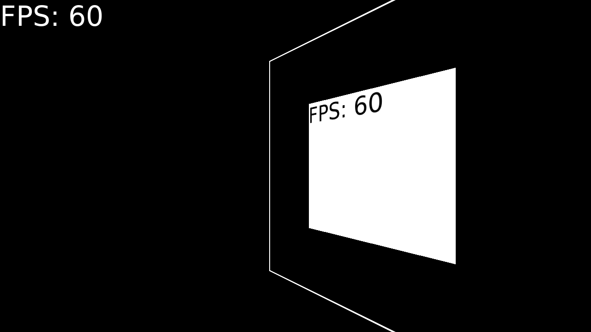

# s3dc

A simple 3D FPS camera that expands the capabilities of a 2D framework. 200 lines of code, no dependencies, no need to work with 3D objects, only work with the camera. See main.lua for an example.

1 unit in 3D space corresponds to 1 pixel. The coordinate system is right-handed.



## Usage
### The library provides the following functions:

#### s3dc.load()
Creates camera state, `Shader` and `Transform`. It is enough to call once.

#### s3dc.show(x, y, w, h)
Moves the camera in front of the specified area of the screen. Note that the origin is in the lower left corner.
```lua
s3dc.show(0, 0, love.graphics.getDimensions())  -- Default rendering area of love2d.
```

#### s3dc.draw_start()
Turns on camera mode. Sets vertex shader and replaces transform. Calling twice in a row will throw an error.

#### s3dc.draw_end()
Turns off camera mode. Disables shader and resets the current coordinate transformation. Calling twice in a row will throw an error.

#### s3dc.draw_update()
Updates internal transformation matrices and sends them to the shader. Called once in `draw_start`. If a camera is changed between `draw_start` and `draw_end`, `draw_update` should be called manually to apply the changes.

#### s3dc.translate(dx, dy, dz)
Moves the position of the camera.

#### s3dc.rotate(dx, dy)
Rotates the camera at `dx` about the y-axis (yaw, left-right), at `dy` about the x-axis (pitch, up-down).

#### s3dc.forward(delta) (also backward, left, right, up, down)
Move in the specified direction by `delta` units.

### The library provides the following variables:
#### s3dc.pos = {0, 0, 0}
Camera position.

#### s3dc.angle = {pitch = 0, yaw = 0}
Camera angle.

#### s3dc.top = {0, 1, 0}
Upward direction, used when moving.

#### s3dc.front = {0, 0, -1}
The direction of your view, used when moving. Depends on yaw and pitch.

#### s3dc.fov = math.rad(70)
Field of view, in radians.

#### s3dc.near = 10
Distance to the near clipping plane.

#### s3dc.far = 10000
Distance to the far clipping plane.
